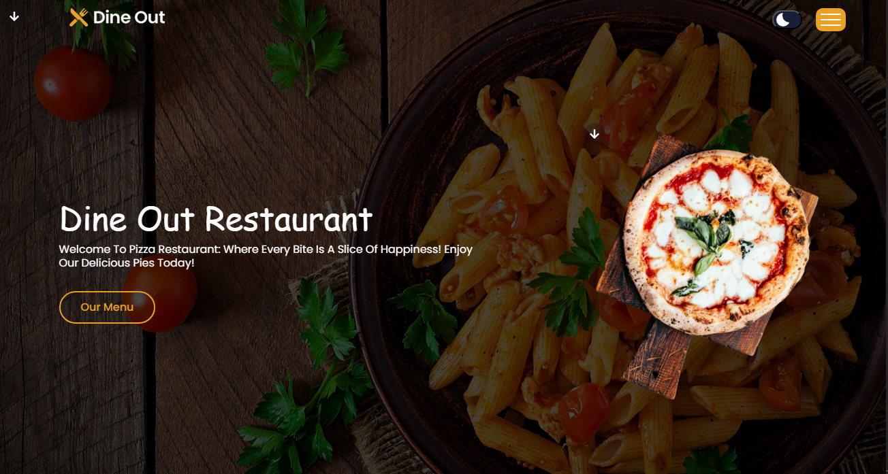

# Dine Out Restaurant Website

Welcome to the README for the Dine Out Restaurant website! This README provides an overview of the website's structure, features, and how to navigate through its various sections.

## Overview

The Dine Out Restaurant website is designed to showcase the offerings and atmosphere of our restaurant, specializing in delicious pizza and other culinary delights. The website is built with HTML, CSS, and JavaScript, offering a responsive and visually appealing user experience.
## 🚀 Demo

## Live Demo [👉🏻 Here♥️](https://eng-ahmed-hussien.github.io/DineOut-Restaurant/)
## Project Screenshots:

## Features

- **Homepage**: Introduces visitors to the restaurant with a visually engaging hero section and a call-to-action to explore the menu.
- **About Us**: Provides information about the restaurant's history, vision, and the experience we offer to our customers.
- **Menu**: Displays our diverse menu offerings, categorized into lunch, dinner, drinks, and desserts.
- **Testimonials**: Showcases feedback and testimonials from satisfied customers, building trust and credibility.
- **Our Chefs**: Highlights the talented chefs behind our delicious dishes, adding a personal touch to the dining experience.
- **Contact Us**: Offers contact information, including address, phone number, and email, along with opening hours and links to social media platforms.

## Structure

The website is structured into different sections, each accessible via the navigation menu:

- **Home**: Introduces the restaurant and invites visitors to explore the menu.
- **About**: Provides insights into the restaurant's story and what sets it apart.
- **Menu**: Displays the mouthwatering offerings available at the restaurant.
- **Testimonials**: Features testimonials from satisfied customers, showcasing the quality of our food and service.
- **Team**: Introduces the talented chefs who create culinary masterpieces in our kitchen.
- **Contact**: Offers contact information and allows visitors to get in touch with us.

## How to Use

1. **Navigation**: Use the navigation menu at the top of the page to explore different sections of the website.
2. **Menu Exploration**: Visit the "Menu" section to browse through our delicious offerings and plan your dining experience.
3. **Testimonials**: Check out the "Testimonials" section to see what our customers have to say about their dining experiences.
4. **Contact Us**: If you have any questions or inquiries, feel free to reach out to us using the contact information provided in the "Contact" section.

## Technologies Used

- HTML5
- CSS3
- JavaScript
- Font Awesome (for icons)
- AOS (Animate on Scroll) library for animations

## Author

This website was designed and developed by Ahmed Hussien. Connect with Ahmed on [GitHub](https://github.com/Eng-Ahmed-Hussien).

Thank you for visiting the Dine Out Restaurant website! We look forward to serving you soon. Enjoy your dining experience! 🍕🍽️
